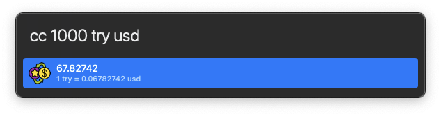

# 💱 YConverter - Beta

All fiat currency and crypto converter

- Type terminal: `convert 1 usd try` to test it
- For Alfred 4: `cc 1 usd try` to test it ([⤵️ Download latest `*.workplace` from release](https://github.com/yedhrab/YConverter/releases))
- ⚠️ Complex queries like `2 TRY PHP` is not working yet!




## ⬇️  Installation

- Recommended installation is `pip` install

```
pip install yconverter
```

## 🔑 Get Your Free Api Key for FIAT

- Click the link: https://openexchangerates.org/signup/free
- Sign up
- Verify your email and use the key that send to your e-mail

## 👮‍♂️ Free Forex API Rate Limits

- Currency Pairs per Request: 2
- Number of Requests per Hour: 100
- Date Range in History: 8 Days
- Allowed Back in History: 1 Year(s)

## Crypto Convertion

- Crypto convertion uses **Binance** tickers
- There is no limit

## 🗄 Cache System

- All data is stored in `$HOME/yconverter.yml`
- All cached pair value are refreshed every **10 mins** for fiat, **1 min** for crypto

## 🪪  License

```
Copyright 2022 Yunus Emre Ak ~ YEmreAk.com

Licensed under the Apache License, Version 2.0 (the "License");
you may not use this file except in compliance with the License.
You may obtain a copy of the License at

    http://www.apache.org/licenses/LICENSE-2.0

Unless required by applicable law or agreed to in writing, software
distributed under the License is distributed on an "AS IS" BASIS,
WITHOUT WARRANTIES OR CONDITIONS OF ANY KIND, either express or implied.
See the License for the specific language governing permissions and
limitations under the License.
```
